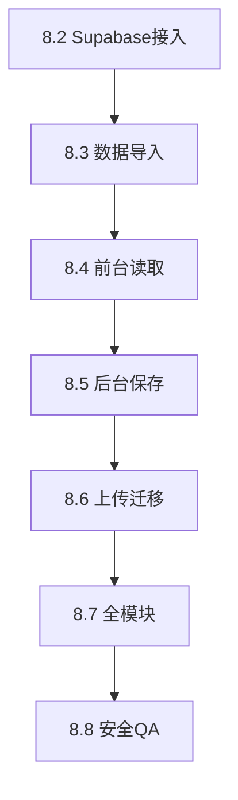

# 8.1 Free Backend Migration Roadmap

> **YU YAKANG AUDIO** — Vercel + Supabase 免费后端实施路线图  
> 前置文档：[FREE_BACKEND_MIGRATION_AUDIT.md](./FREE_BACKEND_MIGRATION_AUDIT.md)  
> 原则：分阶段、可回滚、JSON 兼容、不破坏现有前台成果

---

## 总览

```text
8.2 Supabase 最小接入
  ↓
8.3 内容数据导入
  ↓
8.4 前台读取迁移
  ↓
8.5 后台保存迁移
  ↓
8.6 上传迁移
  ↓
8.7 全模块接入
  ↓
8.8 安全与最终 QA
```

**架构终点：**

- 前台 + 后台 + API 同域 `www.yuyakang.top`
- 数据 Supabase Database + Storage
- Express `server/` 保留但不作为主链路
- `render.yaml` / `api.yuyakang.top` 标记弃用

---

## 8.2 Supabase 最小接入

### 目标

- 创建 Supabase 项目、bucket、最小表结构
- Vercel 配置环境变量（Dashboard 手动，不写 `.env.local` 进仓库）
- 实现 `GET /api/health` serverless 验证 DB 连通
- **不改**前台/后台业务页面

### 修改文件范围

| 新增/修改 | 说明 |
|-----------|------|
| `api/health.js`（或 `api/health.ts`） | Vercel Serverless 入口 |
| `lib/supabaseAdmin.js`（serverless 共享） | service role 客户端 |
| `vercel.json` | 增加 `/api/*` → functions；**暂不**删 admin 重定向 |
| `docs/SUPABASE_SETUP.md`（可选） | 运维备忘 |
| `.env.example` | 增加 Supabase 变量说明（无真实 key） |

**不改：** `src/pages/*`、`src/components/*`（业务）、`HeroVideoCarousel`、案例结构

### 验收标准

- [ ] Supabase 项目创建，`site_content`、`bookings`、`media_assets` 表就绪
- [ ] buckets：`images`、`audio`、`videos` 创建；公开读、禁止 anon 写
- [ ] Vercel Preview 部署 `GET /api/health` 返回 `{ ok: true, supabase: "connected" }`
- [ ] Service role key 未出现在前端 bundle（构建产物 grep 检查）
- [ ] 现有 `www` 前台仍正常（未切流量）

### 回滚策略

- 删除/禁用 Vercel serverless 路由；前台仍走旧 API 或 mock
- Supabase 项目可保留空库

---

## 8.3 内容数据导入

### 目标

- 将 `server/data/site-content.json`（或 example/mock）导入 `site_content` 表
- 将 `bookings.json` 导入 `bookings` 表
- 提供一次性脚本（`scripts/import-to-supabase.mjs`），**不**纳入自动部署

### 修改文件范围

| 新增 | 说明 |
|------|------|
| `scripts/import-to-supabase.mjs` | 本地运行，读 JSON → upsert |
| `scripts/verify-supabase-content.mjs` | 对比 key 数量与 mock 结构 |

**不改：** 业务 React 代码

### 验收标准

- [ ] 所有 ALLOWED section keys + `i18n` + `meta` 在 Supabase 有对应行
- [ ] 抽样 cases 含 `mixingAudioModules` 字段完整
- [ ] `GET` 组装 JSON 与本地 `site-content.json` diff 可接受（脚本报告）
- [ ] 导入脚本 idempotent（可重复跑）

### 回滚策略

- Supabase truncate + 重新导入
- 保留 JSON 源文件为 source of truth 直至 8.8 完成

---

## 8.4 前台读取迁移

### 目标

- 实现 `GET /api/content` serverless：从 Supabase 组装完整 content JSON
- 生产 Vercel 切为同域 API（`VITE_API_URL` 空或同域）
- 保留 mock fallback；Supabase 失败时不黑屏

### 修改文件范围

| 修改 | 说明 |
|------|------|
| `api/content.js` | 读 Supabase → 组装 JSON |
| `vercel.json` | `/api/content` rewrite；移除 `/admin` → Render 重定向 |
| `src/lib/api.js` | 确认生产 `resolveApiBase()` 同域逻辑（可能微调注释/默认） |
| `.env.example` | 更新 VITE_API_URL 说明 |

**仍不改：** 页面组件、Hero、案例 UI

### 验收标准

- [ ] `https://www.yuyakang.top` 首页/About/Cases/Contact 内容来自 Supabase
- [ ] DevTools Network：`GET /api/content` 200，同域
- [ ] 故意使 Supabase 不可用 → 前台仍显示 mock（console warn）
- [ ] `ContentContext.source` 为 `api` 或 `mock`，无白屏
- [ ] Hero 视频、混音播放器、案例筛选行为与迁移前一致

### 回滚策略

- Vercel env 设 `CONTENT_SOURCE=json` feature flag 或回退 deployment
- 临时恢复 `VITE_API_URL=https://api.yuyakang.top`（若 Render 仍可用）

---

## 8.5 后台保存迁移

### 目标

- 实现 `PATCH /api/content/section/[sectionKey]` serverless
- Admin auth cookie 在同域生效
- 实现 `login` / `me` / `logout` serverless

### 修改文件范围

| 新增/修改 | 说明 |
|-----------|------|
| `api/content/section/[sectionKey].js` | PATCH + auth |
| `api/admin/login.js` | POST |
| `api/admin/me.js` | GET |
| `api/admin/logout.js` | POST |
| `lib/auth.js`（共享） | 从 server/lib 抽取或 re-export |

**不改：** Admin 页面 UI；保存仍调用 `saveContentSection`

### 验收标准

- [ ] `https://www.yuyakang.top/admin/login` 可登录（同域）
- [ ] 保存 Hero / Cases / Social 后刷新前台可见
- [ ] 未登录 PATCH 返回 401
- [ ] 保存失败不覆盖旧数据（transaction 或 read-before-write）
- [ ] `profile` / `siteSettings` 互踩场景：文档化「勿双开编辑」或 8.7 做 merge

### 回滚策略

- Serverless 路由指向旧 Express proxy（临时）
- Supabase revision 表恢复（若已启用）

---

## 8.6 上传迁移

### 目标

- `POST /api/upload` → Supabase Storage + 可选 `media_assets` insert
- 返回 URL 兼容 `resolveUploadUrl`（https 公开 URL）
- Admin Media 列表改查 Storage 或 `media_assets`

### 修改文件范围

| 新增/修改 | 说明 |
|-----------|------|
| `api/upload.js` | multipart 解析（busboy）→ Storage upload |
| `api/media/index.js` | GET list |
| `api/media/[filename].js` | DELETE |
| `scripts/migrate-uploads-to-supabase.mjs` | 旧 `/uploads` 批量迁移 |

**不改：** `AdminMediaField` 组件接口（仍 `onChange(url)`）

### 验收标准

- [ ] 后台上传图片/音频成功，URL 可预览
- [ ] 案例封面、混音 track audioUrl 保存后前台可播
- [ ] MIME/大小限制与现 Express 一致
- [ ] 无路径穿越；仅登录可上传
- [ ] 历史 `/uploads/` URL 迁移脚本可批量替换 content JSON

### 回滚策略

- 新上传暂存 feature flag；读仍用旧 URL
- Storage 对象不删，回滚后重新绑定

---

## 8.7 全模块接入

### 目标

- Bookings CRUD → Supabase `bookings` 表
- 所有 Admin 模块端到端验收
- 移除对 Render / `api.yuyakang.top` 的运行时依赖
- 更新部署文档

### 修改文件范围

| 新增/修改 | 说明 |
|-----------|------|
| `api/bookings/index.js` | GET, POST |
| `api/bookings/[id].js` | PATCH |
| `docs/DEPLOY_VERCEL_RENDER_FREE.md` | 标记 Render 弃用，新增 Supabase 章节 |
| `render.yaml` | 顶部注释 `@deprecated` |
| `vercel.json` | 最终路由表 |

### 模块验收清单

| 模块 | 读 | 写 | 上传 |
|------|----|----|------|
| Hero | ✓ | ✓ | 视频/海报 |
| homeSections | ✓ | ✓ | — |
| Profile / Work photos | ✓ | ✓ | 图 |
| Services | ✓ | ✓ | 封面 |
| Cases + mixing audio | ✓ | ✓ | 音频/封面 |
| Certificates | ✓ | ✓ | 图 |
| Social + featuredVideos | ✓ | ✓ | 图/视频 |
| Tutorial | ✓ | ✓ | — |
| Site modules | ✓ | ✓ | — |
| Common tools | ✓ | ✓ | — |
| SEO | ✓ | ✓ | OG 图 |
| Media | ✓ | — | ✓ |
| Bookings | ✓ | ✓ | — |

### 回滚策略

- 全站 Vercel 上一稳定 deployment
- DNS 无需变更（仍 www 单域）

---

## 8.8 安全与最终 QA

### 目标

- 安全审计 checklist 闭环
- 生产 smoke + 手动 QA
- 文档定稿

### 修改文件范围

| 修改 | 说明 |
|------|------|
| `docs/FREE_BACKEND_MIGRATION_AUDIT.md` | 补充「已实施」标注 |
| `scripts/smoke-test.mjs` | 更新 BASE URL 为 www 同域（可选） |
| `docs/PRODUCTION_DEPLOYMENT_CHECKLIST.md` | 更新 |

### 验收标准

- [ ] grep 构建产物无 `SERVICE_ROLE`、`ADMIN_PASSWORD`
- [ ] RLS：anon 无法写 bucket / site_content
- [ ] 全部 15 项「不破坏前台成果」人工回归通过
- [ ] `npm run build` 通过
- [ ] smoke 同域通过或 documented skip
- [ ] Booking 提交 + 后台状态更新 E2E

### 回滚策略

- Vercel instant rollback
- Supabase point-in-time（若付费）或 JSON 导出冷备

---

## 阶段依赖图



---

## 每阶段通用规则

1. **不修改** HeroVideoCarousel、案例 taxonomy、混音模块结构（除非 bugfix 单独立项）
2. **每个 PR/阶段** 可独立部署 Preview 验证
3. **Express server/** 保留至 8.8 完成后至少一个版本
4. **不提交** 密钥；Supabase service role 仅 Vercel Dashboard
5. **保存失败** 必须返回错误，禁止 silent truncate

---

## 下一步

**立即执行：8.2 Supabase 最小接入**

1. 创建 Supabase 项目与三 bucket  
2. 执行 DDL（`site_content`、`bookings`、`media_assets`）  
3. 添加 `api/health` serverless + Vercel env  
4. Preview 部署验证连通性  

---

*路线图版本：8.1 · 对应审计文档 FREE_BACKEND_MIGRATION_AUDIT.md*
