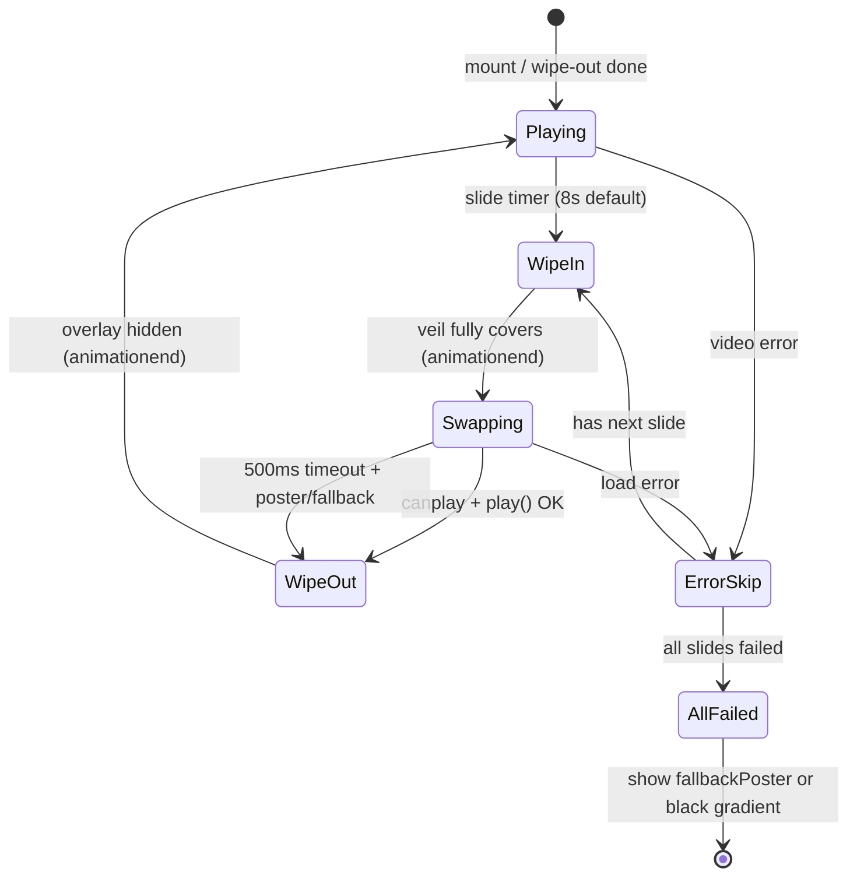

# YU YAKANG AUDIO — 首页 Hero 视频转场方案分析

> **状态：** 方案文档 · 2026-07-05  
> **目的：** 在保留稳定单 video 轮播的前提下，为首页 Hero 增加风格化转场  
> **约束：** 无新依赖 · 无双 video 叠化 · 无复杂动画库 · 不改 API / JSON 结构

---

## 文档说明

| 项 | 说明 |
|---|---|
| 读者 | 产品决策 / 开发排期 |
| 当前基线 | `HeroVideoCarousel.jsx` 已恢复为 **单 `<video>` + 硬切**（无 crossfade） |
| 品牌语言 | Signal Flow · Cue · Patch · 控制台细线 · 黑白极简 |
| 轮播数据源 | `getHeroSlides()` ← `content.cases`（`showInHero` + 有视频） |
| 默认时长 | 8 秒（`hero.slideDuration` / `case.heroDuration` 可覆盖） |

---

## 背景：为何放弃双 video crossfade

Round 3.1.7 曾引入 **current / next 双层 video + opacity crossfade**，出现以下问题：

| 问题 | 原因 |
|---|---|
| 两路视频同时解码播放 | 移动端 CPU/GPU 压力高，易掉帧 |
| 切换时机与 fade 窗口耦合 | `durationMs - fadeMs` 导致播放时长感知不准 |
| 状态机复杂 | `crossfade.from/to/active` + preload 层，边界 case 多 |
| 偶发闪白 / 双音轨感 | 两层 opacity 交叉时底层未完全遮住 |
| 调试成本高 | front/back/preload/solo 多 mode 交织 |

**结论：** 转场应发生在 **video 元素之外**（overlay / poster / 黑场），而非两个 video 之间叠化。

---

## 硬性约束（本轮方案必须满足）

1. 不使用双 video crossfade  
2. 不使用两个视频同时播放  
3. 不安装新依赖（Motion / GSAP / React Transition Group 等）  
4. 保留案例视频自动轮播（`getHeroSlides` 逻辑不变）  
5. 保留默认 8 秒 / 可配置 `heroDuration`  
6. 新增案例有视频且 `showInHero=true` 后仍自动进入首页  
7. 不对 `<video>` 本身做 opacity 动画  

---

## 方案对比

### 方案 A：单 video + Signal Wipe 遮罩转场 ⭐ 推荐

#### 视觉效果

- 当前视频正常播放至切换点（默认 8 秒）  
- 触发转场：黑色半透明遮罩从 0 → 100% 覆盖画面（约 200–350ms）  
- 遮罩内一条 **1px 细 signal line** 横向扫过（与 Logo Signal Pulse、按钮反馈同一视觉语言）  
- 遮罩完全盖住后：**暂停当前 video → 切换 src / index → 等待 canplay**  
- 新视频就绪后：遮罩反向收起或快速淡出（约 150–250ms）  
- 用户感知：**「控制台切 cue」**，不是「电影叠化」

#### 技术复杂度

| 维度 | 评估 |
|---|---|
| 组件状态 | 中等 — 需引入 `transitionPhase: idle \| wipe-in \| swapping \| wipe-out` |
| DOM 结构 | 低 — 单 `<video>` + 一个绝对定位 overlay div |
| CSS | 低 — 纯 `@keyframes` + class toggle |
| JS 逻辑 | 中等 — 时间轴 + `canplay` 事件 + 500ms 超时 fallback |
| 与现有代码耦合 | 低 — 主要改 `HeroVideoCarousel.jsx` + `components.css` |

#### 移动端稳定性

- **高** — 任意时刻仅 1 路 video decode  
- overlay 为 div + CSS，GPU 友好（`transform` / `opacity` 在遮罩上，不在 video 上）  
- `prefers-reduced-motion: reduce` 可降级为 **纯黑场 80ms 硬切**（跳过 signal line）

#### 可能 bug

| 风险 | 缓解 |
|---|---|
| 遮罩动画未结束就切 src，用户看到旧帧闪一下 | 仅在 `wipe-in` 完成（`animationend`）后切 src |
| 新视频 canplay 慢，黑屏停留过长 | 500ms 超时 → 显示 poster 或 `#050505` fallback，继续 wipe-out |
| 计时器与转场重叠，8 秒不准 | 转场期间暂停 progress timer；转场完成后重置 `slideStartRef` |
| iOS 自动播放策略 | 保持 `muted` + `playsInline`；切 src 后在 `canplay` 内 `play()` |
| 快速连续切换 | 转场中忽略新的 `goNext`；或 queue 下一次 |

#### 是否适合当前项目

**非常适合。** 与品牌 Signal Pulse 体系一致，复杂度可控，不引入依赖，且能规避 crossfade 全部已知问题。

---

### 方案 B：单 video + 黑场硬切

#### 视觉效果

- 8 秒到点 → 画面 instant 切到黑（0ms 或极短 50ms）  
- 切换 src → 新视频第一帧出现  
- 无过渡装饰，类似广播切换台 **hard cut**

#### 技术复杂度

**极低** — 几乎就是当前实现 + 可选 1 帧黑屏 div。

#### 移动端稳定性

**最高** — 最少状态、最少 DOM 动画。

#### 可能 bug

- 弱网时黑屏时间不可控（无遮罩动画分散注意力）  
- 视觉偏「裸」，与品牌「控制台感」略弱  
- 若切换时恰好解码慢，用户会感到「卡了一下」

#### 是否适合当前项目

**适合作为 fallback / reduced-motion 模式**，但不满足「有一点风格化转场」的产品诉求。可作为方案 A 的降级路径。

---

### 方案 C：单 video + poster hold 切换

#### 视觉效果

- 8 秒到点 → 当前 video 暂停，**显示当前 slide 的 poster 图**（hold 200–400ms）  
- 后台切换 src，加载完成后 poster 淡出，video 继续播  
- 类似「先定格封面再换片」

#### 技术复杂度

**中低** — 单 video + 一个 `` poster 层（非第二个 video）。

#### 移动端稳定性

**较高** — 仍单 video；poster 为静态图，解码压力小。

#### 可能 bug

| 风险 | 说明 |
|---|---|
| poster 与视频首帧差异大 | 用户感到「跳变」 |
| 部分案例无 poster | 需 fallback 到黑场或 case cover |
| poster hold 期间计时器 | 需明确是否计入 8 秒（建议 **不计入**，hold 仅在切换瞬间） |
| 与方案 A 叠加 | 可作为 A 在 canplay 超时后的 **500ms 等待内容** |

#### 是否适合当前项目

**适合作为方案 A 的子策略**（加载等待态），单独使用风格偏「幻灯片」而非「信号控制台」。

---

### 方案 D：双 video crossfade

#### 视觉效果

- 两路 video 叠加，opacity 0↔1 交叉淡入淡出  
- 电影感强，过渡柔和

#### 技术复杂度

**高** — 已验证过的 front/back/preload 状态机。

#### 移动端稳定性

**低** — 双 decode、内存占用翻倍、Safari 上易出问题。

#### 可能 bug

- 已踩过的全部问题：双播、闪白、时长不准、preload 泄漏、error 处理复杂  
- 与项目「稳定优先」方向冲突

#### 是否适合当前项目

**明确不推荐。** 仅作历史对照；除非未来有专业视频团队专门维护 Hero 播放器。

---

## 方案对比总表

| 维度 | A Signal Wipe | B 黑场硬切 | C Poster Hold | D 双 video Crossfade |
|---|---|---|---|---|
| 风格化程度 | ★★★★ | ★ | ★★★ | ★★★★★ |
| 技术复杂度 | 中 | 极低 | 中低 | 高 |
| 移动端稳定 | 高 | 最高 | 较高 | 低 |
| bug 风险 | 低（可控） | 极低 | 中 | 高（已验证） |
| 品牌契合 | ★★★★★ | ★★ | ★★★ | ★★ |
| 新依赖 | 无 | 无 | 无 | 无 |
| 推荐 | ✅ 主方案 | ✅ 降级 | ⚠️ 辅助 | ❌ 禁止 |

---

## 推荐结论

### ✅ 推荐方案：A — 单 video + Signal Wipe 遮罩转场

与用户倾向一致，理由：

1. **单 video 全程** — 从根上消除 crossfade bug 类  
2. **转场在 overlay 上** — video 不做 opacity 动画  
3. **Signal line** — 与 Logo Pulse、按钮 signal、后台控制台视觉统一  
4. **可降级** — `prefers-reduced-motion` → 方案 B；canplay 超时 → 方案 C poster / 黑场  
5. **零依赖** — 纯 React state + CSS `@keyframes`  

### ❌ 不推荐方案

| 方案 | 原因 |
|---|---|
| **D 双 video crossfade** | 已证明不稳定；违背本轮全部约束 |
| **单独使用 B 作为主方案** | 太裸，不满足「有一点风格化」 |
| **引入 Motion / GSAP** | 违反约束；Hero 不值得为转场增加 bundle 与维护面 |

### ⚠️ 组合策略（推荐实现方式）

```
正常路径:     A (Signal Wipe)
reduced-motion: B (80ms 黑场硬切)
canplay 超时:   C (poster hold) 或 #050505 fallback
错误路径:       现有 handleVideoError → 跳下一条（可套 A 遮罩或直接硬切）
```

---

## 方案 A 详细设计（实施参考，本文档不含代码）

### 时间轴（单次切换）

| 阶段 | 时长 | 动作 |
|---|---|---|
| `playing` | 默认 8000ms | 单 video 播放；progress bar 更新 |
| `wipe-in` | 250–350ms | overlay opacity 0→1；signal line 左→右 |
| `swapping` | 0–500ms | video.pause() → 改 src / index → 等 `canplay` 或超时 |
| `wipe-out` | 150–250ms | overlay opacity 1→0；video.play() |
| `playing` | 下一轮 8000ms | 重置 progress；更新 PROJECT xx / xx |

**注意：** 8 秒计时 **不包含** wipe-in/out 时长（用户仍感知「每条视频约 8 秒内容」）。

### DOM 结构（概念）

```
.hero__carousel-stack          ← background: #050505
  .hero__carousel-layer
    <video>                     ← 始终 1 个，不做 opacity 动画
  .hero__carousel-wipe           ← overlay，仅转场时可见
    .hero__carousel-wipe__veil   ← rgba(0,0,0,0.85~0.95)
    .hero__carousel-wipe__signal ← 1px 横向扫线
  .hero__carousel-status         ← 现有 PROJECT / title / progress
```

### 状态机

```
                    ┌─────────────┐
                    │   playing   │◄────────────────────┐
                    └──────┬──────┘                     │
                           │ durationMs elapsed         │
                           ▼                            │
                    ┌─────────────┐                     │
                    │   wipe-in   │                     │
                    └──────┬──────┘                     │
                           │ animationend               │
                           ▼                            │
                    ┌─────────────┐   canplay          │
                    │   swapping  │────────────────────┤
                    └──────┬──────┘   timeout 500ms     │
                           │         → poster/fallback  │
                           ▼                            │
                    ┌─────────────┐                     │
                    │  wipe-out   │                     │
                    └──────┬──────┘                     │
                           │ animationend               │
                           └────────────────────────────┘
```

### 状态流程图（Mermaid）



### CSS 命名建议

| Class | 用途 |
|---|---|
| `.hero__carousel-wipe` | overlay 容器 |
| `.hero__carousel-wipe--active` | 显示遮罩 |
| `.hero__carousel-wipe--in` | wipe-in 动画 |
| `.hero__carousel-wipe--out` | wipe-out 动画 |
| `.hero__carousel-wipe__signal` | signal line |
| `@keyframes heroSignalWipeIn` | 遮罩 + 扫线进入 |
| `@keyframes heroSignalWipeOut` | 遮罩退出 |

### 参考思路（不引入库）

| 参考 | 借鉴点 |
|---|---|
| **Video.js** | `readyState` / `error` 事件分层；失败自动 fallback |
| **React Transition Group** | enter/exit class 命名；`animationend` 驱动状态推进 |
| **Motion** | micro interaction 时长（200–350ms），不引入库 |
| **GSAP** | timeline 顺序：veil → swap → reveal，用 `setTimeout` + `animationend` 实现 |

---

## 需要改哪些文件（未来实施时）

| 文件 | 变更范围 | 说明 |
|---|---|---|
| `src/components/home/HeroVideoCarousel.jsx` | **主要** | 状态机、overlay、切 src 时机、canplay 超时 |
| `src/styles/components.css` | **主要** | wipe overlay + signal line 动画 |
| `src/components/home/HeroSection.jsx` | 可能微调 | 一般无需改；除非 mobile poster mode 也要 wipe |
| `src/lib/content.js` | **不改** | `getHeroSlides` / 8 秒逻辑已满足 |
| 后台 / API / JSON | **不改** | 转场纯前端表现层 |

**不建议改：** Logo、按钮、后台中文化、PageTransition、案例详情页。

---

## 风险点

| # | 风险 | 等级 | 缓解 |
|---|---|---|---|
| 1 | 8 秒 + 转场总时长变长 | 低 | 转场不计入 8 秒；wipe 总时长控制在 600ms 内 |
| 2 | iOS `canplay` 触发时机不一致 | 中 | 同时监听 `loadeddata`；500ms 超时 + poster |
| 3 | 切换中用户切 tab / 页面 hidden | 中 | `visibilitychange` 时 pause timer + overlay |
| 4 | `prefers-reduced-motion` 未处理 | 低 | 降级为方案 B 硬切 |
| 5 | 移动端 `usePosterMode` 与 wipe 冲突 | 中 | 手机端可禁用 wipe，仅 poster 切换或静态 hold |
| 6 | 回归 crossfade 诱惑 | 低 | Code review 禁止第二 `<video>`；ESLint 注释约束 |
| 7 | progress bar 在 wipe 期间跳动 | 低 | wipe 阶段 freeze progress |

---

## 测试清单

### 功能

- [ ] 桌面：每条视频约 8 秒后触发 Signal Wipe 转场  
- [ ] 转场期间仅 1 个 `<video>` 存在于 DOM  
- [ ] 转场期间 video 不同时播放两路内容  
- [ ] 遮罩完全覆盖后才切换 src  
- [ ] 新视频 canplay 后遮罩消失并开始播放  
- [ ] canplay 超过 500ms 时显示 poster 或黑色 fallback  
- [ ] 视频 error 自动跳下一条  
- [ ] 全部失败显示 `fallbackPoster` 或黑色渐变  
- [ ] 右下角 `PROJECT 01 / 04`、标题、进度条正常  
- [ ] 新增案例（有视频 + `showInHero=true`）刷新后出现在轮播  

### 视觉

- [ ] 无 crossfade / 无双 video 叠影  
- [ ] 无闪白（stack 背景 `#050505`）  
- [ ] signal line 细、克制，非霓虹  
- [ ] `prefers-reduced-motion` 下无扫线动画  

### 兼容

- [ ] Chrome / Edge 桌面  
- [ ] Safari iOS（playsInline + muted）  
- [ ] 390px 移动端  
- [ ] 弱网（Slow 3G 模拟）  

### 回归

- [ ] `/admin/hero` 正常  
- [ ] `/admin/cases` 保存正常  
- [ ] Logo Signal Pulse 未受影响  
- [ ] 前台中英文切换未受影响  
- [ ] `npm run build` 通过  
- [ ] `npm run test:smoke` 20/20 通过  
- [ ] Console 无红色报错  
- [ ] API 无 500  

---

## 参数建议（拍板用）

| 参数 | 建议值 | 可调 |
|---|---|---|
| 默认播放时长 | 8s | 后台 `slideDuration` / case `heroDuration` |
| wipe-in | 280ms | 250–350ms |
| wipe-out | 200ms | 150–250ms |
| canplay 超时 | 500ms | 400–800ms |
| 遮罩 opacity | 0.88–0.94 | 避免纯黑死屏感 |
| signal line 高度 | 1px | 与 Logo signal 一致 |
| reduced-motion | 80ms 硬切 | 无扫线 |

---

## 总结

| 项 | 结论 |
|---|---|
| **推荐方案** | **A — 单 video + Signal Wipe 遮罩转场** |
| **不推荐** | D（双 video crossfade）；单独 B 作为主方案 |
| **辅助** | C（poster hold）用于 canplay 等待；B 用于 reduced-motion |
| **核心原则** | 转场做在 overlay 上，video 只负责播内容 |
| **下一步** | 确认参数后，仅改 `HeroVideoCarousel.jsx` + `components.css` 实施 |

---

*本文档为分析与方案建议，不包含实现代码。确认后可作为 Round 3.5（或独立 hotfix）的实施依据。*
